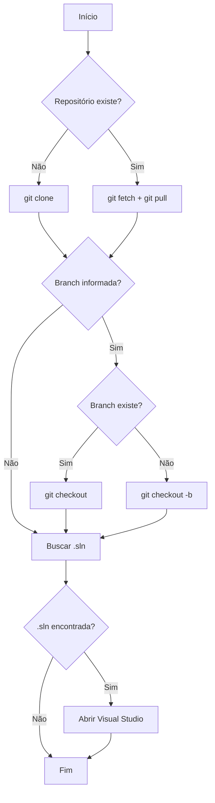

# ?? Automação Git - Sistema de Preparação de Repositórios

Sistema completo de automação para preparação de repositórios Git com integração ao Visual Studio.

## ?? Índice

- [Características](#características)
- [Arquitetura](#arquitetura)
- [Uso da Interface](#uso-da-interface)
- [Uso Programático](#uso-programático)
- [Estrutura do Projeto](#estrutura-do-projeto)
- [Requisitos](#requisitos)

## ? Características

- ? **Clone automático** de repositórios Git
- ? **Atualização automática** (git pull) para repositórios existentes
- ? **Gerenciamento de branches** (criação/checkout)
- ? **Logs em tempo real** com timestamps
- ? **Abertura automática** no Visual Studio
- ? **Suporte a prompts de IA** para automações futuras
- ? **Cancelamento de operações**
- ? **Tratamento robusto de erros**
- ? **Arquitetura limpa** com separação de responsabilidades

## ??? Arquitetura

### Camadas

```
Models/
  ??? DTOs/                    # Objetos de transferência de dados
  ??? Enums/                   # Enumerações (Status)

Services/
  ??? Interfaces/              # Contratos de serviços
  ??? Implementations/         # Implementações concretas

Helpers/                       # Utilitários (ProcessHelper)
```

### Componentes Principais

#### 1. GitAutomationService
Orquestra todo o fluxo de automação Git:
- Validação de pré-requisitos
- Clone/Atualização de repositórios
- Gerenciamento de branches
- Persistência de prompts de IA

#### 2. VisualStudioLauncher
Responsável por abrir a solution no Visual Studio:
- Busca automática de arquivos .sln
- Abertura usando associação do Windows

#### 3. ProcessHelper
Wrapper para execução de comandos:
- Execução assíncrona de processos
- Captura de saída e erros
- Suporte a cancelamento

## ?? Uso da Interface

### Passo a Passo

1. **Configurar Repositório**
   - URL do repositório Git (Azure DevOps, GitHub, etc.)
   - Caminho local base (ex: `C:\Projetos`)
   - Nome da pasta do projeto

2. **Configurações Opcionais**
   - Nome da branch (para criar/trocar)
   - Prompt de IA (salvo em `.ai-prompt.txt`)

3. **Executar Automação**
   - Clique em "?? Executar Automação"
   - Acompanhe os logs em tempo real
   - Aguarde abertura automática do Visual Studio

### Exemplos de Valores

```
URL do Repositório:
https://dev.azure.com/org/project/_git/meu-repo

Caminho Local Base:
C:\Projetos

Nome da Pasta:
MeuProjeto

Branch (opcional):
feature/nova-funcionalidade

Prompt IA (opcional):
Implementar endpoint de autenticação usando JWT
```

## ?? Uso Programático

### Exemplo Básico

```csharp
// Criar instâncias dos serviços
var gitService = new GitAutomationService();
var vsLauncher = new VisualStudioLauncher();

// Configurar requisição
var request = new GitAutomationRequest
{
    RepositoryUrl = "https://dev.azure.com/org/project/_git/repo",
    LocalBasePath = @"C:\Projetos",
    ProjectFolderName = "MeuProjeto",
    BranchName = "develop", // Opcional
    AIPrompt = "Criar API REST" // Opcional
};

// Executar com logs em tempo real
var result = await gitService.ExecuteAutomationAsync(
    request,
    onLogReceived: (log) => Console.WriteLine(log),
    cancellationToken: CancellationToken.None
);

// Verificar resultado
if (result.IsSuccess)
{
    Console.WriteLine($"? Concluído em {result.Duration?.TotalSeconds:F2}s");
    
    // Abrir no Visual Studio
    var solutionPath = vsLauncher.FindSolutionFile(request.FullProjectPath);
    if (solutionPath != null)
    {
        await vsLauncher.OpenSolutionAsync(solutionPath);
    }
}
else
{
    Console.WriteLine($"? Falhou: {result.Status}");
    foreach (var error in result.Errors)
    {
        Console.WriteLine($"  - {error}");
    }
}
```

### Exemplo com Injeção de Dependência

```csharp
// Startup.cs ou Program.cs
services.AddSingleton<IGitAutomationService, GitAutomationService>();
services.AddSingleton<IVisualStudioLauncher, VisualStudioLauncher>();

// Uso em Controller/ViewModel
public class MyViewModel
{
    private readonly IGitAutomationService _gitService;
    
    public MyViewModel(IGitAutomationService gitService)
    {
        _gitService = gitService;
    }
    
    public async Task ExecuteAsync()
    {
        var request = new GitAutomationRequest { /* ... */ };
        var result = await _gitService.ExecuteAutomationAsync(request);
    }
}
```

### Exemplo com Cancelamento

```csharp
var cts = new CancellationTokenSource();

// Em outro thread/task
Task.Run(async () =>
{
    await Task.Delay(5000);
    cts.Cancel(); // Cancela após 5 segundos
});

var result = await gitService.ExecuteAutomationAsync(
    request,
    onLogReceived: null,
    cancellationToken: cts.Token
);

if (result.Status == GitOperationStatus.Cancelled)
{
    Console.WriteLine("Operação cancelada!");
}
```

## ?? Estrutura do Projeto

```
AutomacaoGIT/
?
??? Models/
?   ??? DTOs/
?   ?   ??? GitAutomationRequest.cs      # Request com parâmetros
?   ?   ??? GitAutomationResult.cs       # Response com logs
?   ??? Enums/
?       ??? GitOperationStatus.cs        # Status da operação
?
??? Services/
?   ??? Interfaces/
?   ?   ??? IGitAutomationService.cs     # Contrato de automação
?   ?   ??? IVisualStudioLauncher.cs     # Contrato de launcher
?   ??? Implementations/
?       ??? GitAutomationService.cs      # Implementação principal
?       ??? VisualStudioLauncher.cs      # Implementação de launcher
?
??? Helpers/
?   ??? ProcessHelper.cs                 # Helper para processos
?
??? MainWindow.xaml                      # Interface WPF
??? MainWindow.xaml.cs                   # Code-behind
??? App.xaml                             # Aplicação WPF
```

## ?? Requisitos

### Software Necessário

- ? **.NET 8.0** ou superior
- ? **Git** instalado e no PATH
- ? **Visual Studio** (para abertura automática)

### Verificar Git Instalado

```bash
git --version
```

Deve retornar algo como: `git version 2.x.x`

### Configurar Git (se necessário)

```bash
git config --global user.name "Seu Nome"
git config --global user.email "seu.email@empresa.com"
```

## ?? Fluxo de Execução



## ?? Casos de Uso

### 1. Novo Desenvolvedor no Time
Clonar repositório e abrir no VS automaticamente.

### 2. Nova Feature
Criar branch de feature e preparar ambiente.

### 3. Code Review
Fazer checkout da branch do PR rapidamente.

### 4. Atualização Diária
Atualizar todos os repositórios com um clique.

### 5. Automação com IA
Preparar repositório e deixar prompt para agente de IA processar.

## ??? Melhorias Futuras

- [ ] Suporte a múltiplos repositórios em batch
- [ ] Integração com Azure DevOps API
- [ ] Histórico de execuções
- [ ] Profiles salvos (repositórios favoritos)
- [ ] Integração com ferramentas de IA (Copilot, ChatGPT)
- [ ] Suporte a submodules Git
- [ ] Detecção automática de IDE (VS Code, Rider, etc.)

## ?? Licença

Este projeto é de uso interno. Todos os direitos reservados.

## ?? Contribuindo

Para contribuir com melhorias:
1. Crie uma branch de feature
2. Faça suas alterações
3. Submeta um Pull Request
4. Aguarde code review

---

**Desenvolvido com ?? para aumentar a produtividade do time**
